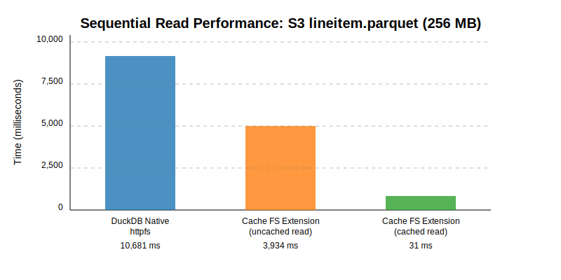

# duck-read-cache-fs

A DuckDB extension for remote filesystem access cache.

## Loading cache httpfs
Since DuckDB v1.0.0, cache httpfs can be loaded as a community extension without requiring the `unsigned` flag. From any DuckDB instance, the following two commands will allow you to install and load the extension:
```sql
INSTALL cache_httpfs from community;
LOAD cache_httpfs;
```
See the [cache httpfs community extension page](https://community-extensions.duckdb.org/extensions/cache_httpfs.html) for more information.

## Introduction

This repository is made as read-only filesystem for remote access, which serves as cache layer above duckdb [httpfs](https://github.com/duckdb/duckdb-httpfs).

Key features:
- Caching, which adds support for remote file access to improve IO performance and reduce egress cost; several caching options are supported
  + in-memory, cache fetched file content into blocks and leverages a LRU cache to evict stale blocks
  + on-disk (default), already read blocks are stored to load filesystem, and evicted on insufficient disk space based on their access timestamp
  + no cache, it's allowed to disable cache and fallback to httpfs without any side effects
- Parallel read, read operations are split into size-tunable chunks to increase cache hit rate and improve performance
- Profiling helps us to understand system better, key metrics measured include cache access stats, and IO operation latency, we plan to support multiple types of profile result access; as of now there're three types of profiling
  + temp, all access stats are stored in memory, which could be retrieved via `SELECT cache_httpfs_get_profile();`
  + duckdb (under work), stats are stored in duckdb so we could leverage its rich feature for analysis purpose (i.e. use histogram to understant latency distribution)
  + profiling is by default disabled
- 100% Compatibility with duckdb `httpfs`
  + Extension is built upon `httpfs` extension and automatically load it beforehand, so it's fully compatible with it; we provide option `SET cache_httpfs_type='noop';` to fallback to and behave exactly as httpfs.
- Able to wrap **ALL** duckdb-compatible with one simple SQL `SELECT cache_httpfs_wrap_cache_filesystem(<your-fs>)`, and get all the benefit of caching, parallel read, IO performance stats, you name it.

Caveat:
- The extension is implemented for object storage, which is expected to be read-heavy workload and (mostly) immutable, so it only supports read cache (at the moment), cache won't be cleared on write operation for the same object.
  We provide workaround for overwrite -- user could call `cache_httpfs_clear_cache` to delete all cache content, and `cache_httpfs_clear_cache_for_file` for a certain object.
- Filesystem requests are split into multiple sub-requests and aligned with block size for parallel IO requests and cache efficiency, so for small requests (i.e. read 1 byte) could suffer read amplification.
  A workaround for reducing amplification is to tune down block size via `cache_httpfs_cache_block_size` or fallback to native httpfs.

## Example usage
```sql
-- No need to load httpfs.
D LOAD cache_httpfs;
-- Create S3 secret to access objects.
D CREATE SECRET my_secret (      TYPE S3,      KEY_ID '<key>',      SECRET '<secret>',      REGION 'us-east-1',      ENDPOINT 's3express-use1-az6.us-east-1.amazonaws.com');
┌─────────┐
│ Success │
│ boolean │
├─────────┤
│ true    │
└─────────┘

-- Set cache type to in-memory.
D SET cache_httpfs_type='in_mem';

-- Access remote file.
D SELECT * FROM 's3://s3-bucket-user-2skzy8zuigonczyfiofztl0zbug--use1-az6--x-s3/t.parquet';
┌───────┬───────┐
│   i   │   j   │
│ int64 │ int64 │
├───────┼───────┤
│     0 │     1 │
│     1 │     2 │
│     2 │     3 │
│     3 │     4 │
│     4 │     5 │
├───────┴───────┤
│    5 rows     │
└───────────────┘
```

For more example usage, checkout [example usage](/doc/example_usage.md)

## [More About Benchmark](/benchmark/README.md)




## Development

For development, the extension requires [CMake](https://cmake.org), and a `C++14` compliant compiler. Run `make` in the root directory to compile the sources. For development, use `make debug` to build a non-optimized debug version. You should run `make unit`.

Please also refer to our [Contribution Guide](https://github.com/dentiny/duck-read-cache-fs/blob/main/CONTRIBUTING.md).
